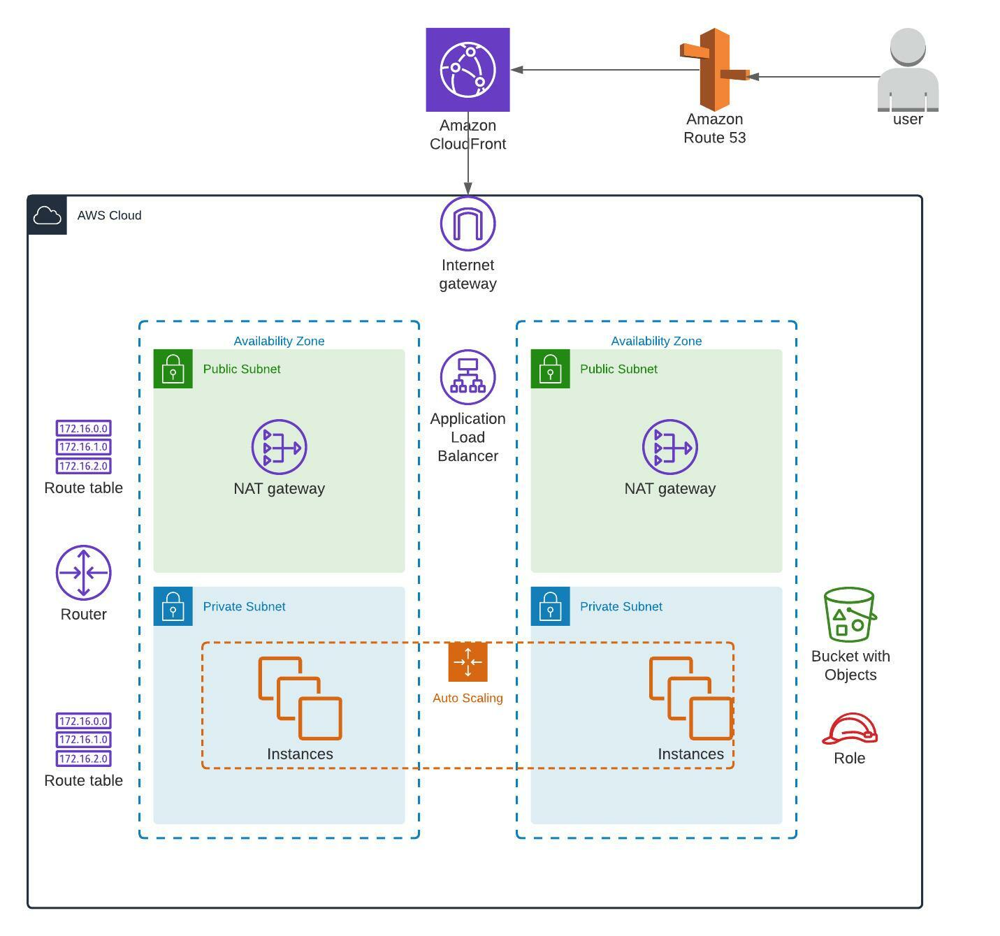

# AWS Load Balanced Website + DNS + CDN

This project aims to deploy a sample website in a load-balanced, highly available, and resilient manner utilizing automation and AWS best practices.

**Built with**

Terraform manages the deployment.

**Requirements**

1. AWS account
2. IAM user with admin privileges
3. Access and secret keys
4. AWS CLI
5. Terraform installed

**AWS resources created**

* 1 x VPC
* 2 x Private subnets
* 2 x Public subnets
* 2 x NAT Gateways
* 1 x Internet Gateway
* 1 x ALB
* 1 x ASG
* 1 x Launch Configuration
* 4 x EC2
* 3 x Security Groups
* 2 X CloudWatch Alarms
* 1 x S3 bucket
* 1 x IAM role
* 1 x AIM policy
* 1 x Route53 DNS A record
* 1 x Bastion host
* 1 x Cloudfront distribution

**Getting started**

Clone the repository locally in your system:

`git clone https://github.com/cloudacia/terraform-lab02`

Deploy the code in your AWS account with Terraform

`cd terraform-lab12`

`terraform init`

`terraform validate`

`terraform plan`

`terraform apply`

`terraform destroy`

**Folder structure options and naming conventions for software projects**
```
.
|-- main.tf                 # AWS provider's configuration
|-- admin.tf                # Bastion host and security group
|-- networking.tf           # VPC, subnet, routing tables, etc.
|-- autoscaling.tf          # AutoScaling and Launch configuration
|-- loadbalancer.tf         # Load balancer and target group
|-- launch_configuration.tf # EC2 launch configuration
|-- monitoring.tf           # CloudWatch Alarms
|-- security.tf             # Security groups
|-- ssh_keys.tf             # EC2 public key
|-- variables.tf            # Variables
|-- iam.tf                  # AIM roles and policies
|-- storage.tf              # S3 buckets
|-- dns.tf                  # DNS setting for a domain name
|-- cdn.tf                  # Cloudfront distribution
|-- output.tf               # Output values
|-- bootstraping            # Initialization script
|-- /app                    # Simple Python web app
|-- diagram.png             # AWS network layout
|-- LICENSE.txt
|-- README.md
```

**Architecture**



**Contributing**

Contributions are what make the open-source community such an amazing place to learn, inspire, and create. Any contributions you make are greatly appreciated.

If you have a suggestion to improve this, please fork the repo and create a pull request. You can also open an issue with the tag "enhancement".

Don't forget to give the project a star! Thanks again!

**License**

It is distributed under the MIT License. See LICENSE.txt for more information.

**Contact**

Name: Eugenio Duarte

Email: eduarte@cloudacia.com
